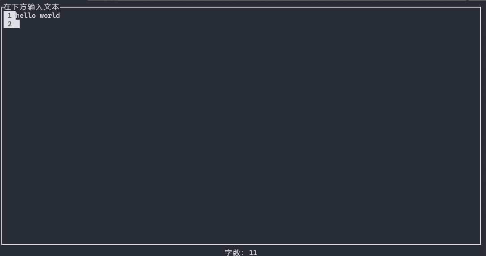
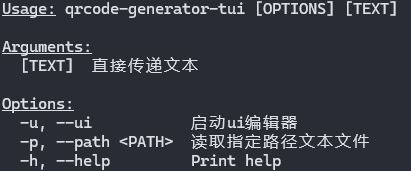

# qrcode-generator-tui

使用[ratatui](https://ratatui.rs)编写的离线轻量化终端二维码生成器。

演示：

帮助：

## TODO
- 终端显示二维码
- 流式二维码（喷泉算法）

## License

Copyright (c) LingLambda <abc1514671906@163.com>

This project is licensed under the MIT license ([LICENSE] or <http://opensource.org/licenses/MIT>)

[LICENSE]: ./LICENSE
